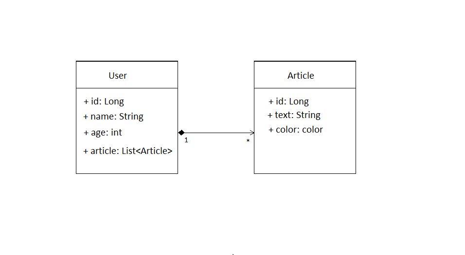

### ** Test  Junior Java**

This web project is based on the principles of SOLID and a three-tier software architecture. 
It implements security: JWT-based.

Completed structure of project is described below

When the application starts, five users are added by default. Therefore, they can be used to 
authenticate or register a new user using endpoint "/register".
Below are the default usernames and passwords.

Bob 1111, Alice 2222, Tom 3333, Ilon 4444, Iren 5555.

Next, you need to authenticate using endpoint "/login".

### **Features provided by the application for registered users**

You are given the following endpoints:

    POST: /users/uder - add user
    POST: /article - add article
    GET: /users - get all users
    GET: /users/age/{age} - returns users who are older than age 
    GET: /users/articles - returns users who have the desired color
    GET: /users/name - returns usernames that have more than three Articles

Endpoints that are accessible without authentication: "/login", "/register", "/h2-console/*".

### **Technologies**
1. Java 11
2. Maven
3. H2 
4. Spring Boot
5. Spring Data
6. Spring Security
